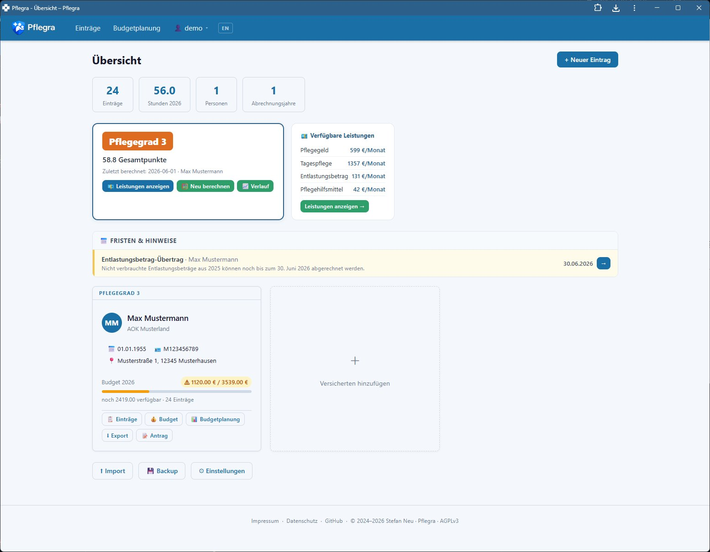
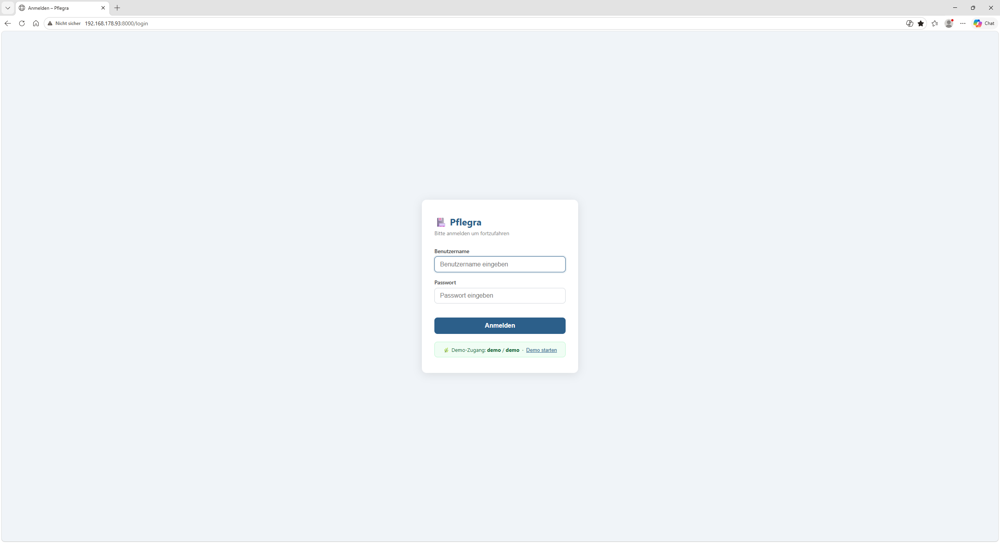
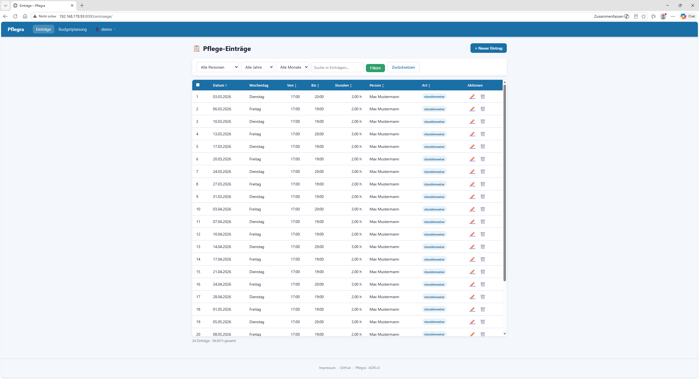
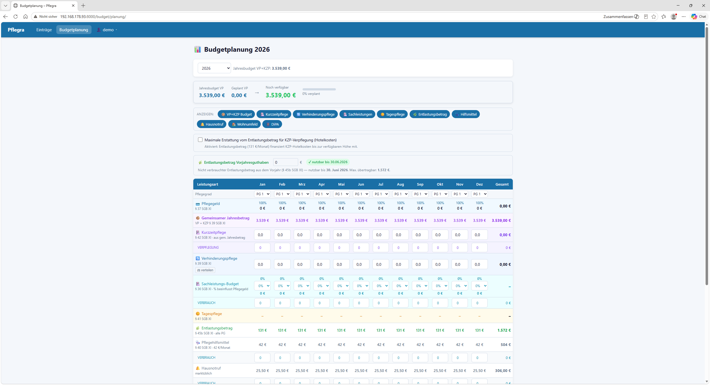
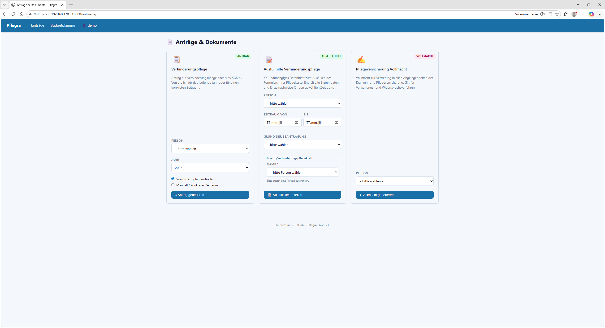
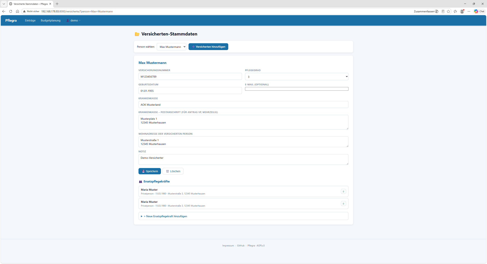

# Pflegra

<p align="center">
  <a href="https://github.com/Pflegra/core/releases/latest"></a>
  <a href="https://github.com/Pflegra/core/pkgs/container/core"></a>
  <a href="LICENSE"></a>
  <a href="https://pflegra.app"></a>
  
</p>

<p align="center">
  
</p>

**A self-hosted care management platform for planning, organizing and tracking German care benefits (SGB XI).**

Pflegra helps families and care providers manage Verhinderungspflege, Kurzzeitpflege, and all related benefits — without spreadsheets, without data leaving your home.

---

## Features

- **Care record tracking** — log Verhinderungspflege entries with date, time, duration and care type
- **Budget management** — real-time VP+KZP budget status, 56-day limit tracking, annual prognosis
- **Budget simulator** — plan your full year across all benefit types (§ 36, § 37, § 39, § 40, § 41, § 45b SGB XI)
- **Rules engine** — all legal benefit amounts centralized in `pflege_rules.py`, updated per year
- **Care level calculator** — NBA assessment tool (§ 15 SGB XI), all 6 modules, 57 criteria with plain-language explanations, PDF report
- **Benefit finder** — structured benefit overview by care level, setting and benefit type
- **Care level history** — save and track assessments over time with trend chart
- **Entlastungsbetrag tracking** — monthly budget, prior-year carryover indicator (§ 45b SGB XI)
- **Ausfüllhilfe** — KK-independent data sheet for filling out your Pflegekasse's own forms
- **PDF exports** — care records, budget reports, application letters, care level assessment reports
- **Ersatzpflegekräfte** — manage substitute carers in Stammdaten, select per entry
- **Automatic backups** — daily, configurable retention, with restore
- **Multi-user support** — per-user data isolation, roles (admin/user), user management
- **Demo system** — built-in `demo/demo` account with sample data, auto-reset on logout
- **i18n DE/EN** — full German and English UI, language switcher in navbar
- **HTTPS / Tailscale** — built-in Tailscale integration for secure remote access
- **Home Assistant Add-on** — runs natively on HA OS, no extra hardware needed
- **Docker deployment** — for standalone server or VM

---

## Screenshots

| Login | Dashboard |
|---|---|
|  |  |

| Pflege-Einträge | Budgetplanung |
|---|---|
|  |  |

| Anträge & Dokumente | Versicherten-Stammdaten |
|---|---|
|  |  |

---

## Quick Start

### Option A — Docker Desktop (recommended for Windows/Mac)

1. Install [Docker Desktop](https://www.docker.com/products/docker-desktop)
2. Clone the repository or download the ZIP
3. Double-click `start.bat` (Windows) or run `./start.sh` (Mac/Linux)
4. Pflegra opens automatically at `http://localhost:8000`

**Or as a one-liner:**
```bash
docker run -d -p 8000:8000 -v pflegra_data:/data ghcr.io/pflegra/core:latest
```

### Option B — Home Assistant Add-on

1. Copy the add-on folder to `/addons/pflegra/` on your HA instance
2. Install via **Settings → Add-ons → Local Add-ons**
3. Start and open the Web UI on port `8000`
4. For remote HTTPS access install the Tailscale Add-on separately

**First login:** an `admin` account is created automatically from your existing config, or set up via `/setup` on first run.  
**Demo access:** `demo` / `demo` — resets automatically on logout.

### Option C — Docker Compose

```bash
git clone https://github.com/Pflegra/core.git
cd core
cp .env.example .env
# Edit .env — set a secure PFLEGRA_SECRET
docker compose up -d
```

Open `http://localhost:8000` in your browser.

### Option D — Direct (Python 3.11+)

```bash
cd app
pip install -r requirements_web.txt
uvicorn web.app:app --host 0.0.0.0 --port 8000 --app-dir app
```

---

## Requirements

| Component | Minimum |
|---|---|
| Python | 3.11+ |
| RAM | 256 MB |
| Disk | 500 MB |
| OS | Linux, HA OS, macOS, Windows (via Docker) |

---

## Supported benefit types (2026)

| Benefit | Legal basis | Amount |
|---|---|---|
| VP + KZP (shared pool) | § 39 SGB XI | 3.539 €/year |
| Pflegegeld PG 2–5 | § 37 SGB XI | 347 – 990 €/month |
| Pflegesachleistungen PG 2–5 | § 36 SGB XI | 796 – 2.299 €/month |
| Tagespflege PG 2–5 | § 41 SGB XI | 721 – 2.085 €/month |
| Entlastungsbetrag | § 45b SGB XI | 131 €/month |
| Pflegehilfsmittel | § 40 SGB XI | 42 €/month |
| Wohnumfeldverbesserung | § 40 SGB XI | 4.180 € per measure |
| Hausnotruf | — | 25,50 €/month |
| DiPA App | § 40a SGB XI | 40 €/month |
| DiPA Unterstützung | § 40a SGB XI | 30 €/month |

All amounts live in `app/pflege_rules.py` — one file to update when the law changes.

---

## Architecture

```
app/
├── pflege_rules.py          # Central rules engine — all legal amounts per year
├── calculations.py          # Budget calculations, prognosis logic
├── leistungsfinder.py       # Benefit finder logic
├── pflegegrad_rechner.py    # NBA care level calculator (§ 15 SGB XI)
├── models.py                # DB facade — re-exports all db/ modules
├── db/
│   ├── schema.py            # DB schema v14, migrations
│   ├── eintraege.py         # Care entries
│   ├── personen.py          # Persons
│   ├── versicherte.py       # Insured persons
│   ├── users.py             # User accounts
│   ├── ersatzpflege.py      # Substitute carers
│   ├── settings.py          # User settings + budget planning
│   ├── entlastung.py        # Entlastungsbetrag bookings
│   └── pflegegrad_verlauf.py # Care level history
├── services/
│   ├── budget_service.py    # Budget calculations, warnings
│   ├── export_service.py
│   ├── import_service.py
│   └── backup_service.py
├── i18n.py                  # DE/EN translation system
├── translations/
│   ├── de.json
│   └── en.json
├── demo_reset.py            # Demo user reset (on logout + every 60 min)
├── web/
│   ├── auth.py              # Multi-user auth, sessions, roles
│   ├── routers/
│   │   ├── deps.py          # base_ctx, get_db, get_owner_id, get_user_settings
│   │   ├── eintraege.py
│   │   ├── versicherte.py
│   │   ├── antraege.py
│   │   ├── einstellungen.py
│   │   ├── entlastung.py
│   │   ├── pflegegrad.py    # Care level calculator + history
│   │   ├── leistungsfinder.py
│   │   ├── login.py
│   │   └── admin.py
│   ├── templates/           # Jinja2 HTML templates (26 templates)
│   └── static/
└── tests/                   # 52+ pytest tests
```

**Stack:** FastAPI · Jinja2 · SQLite · ReportLab · Python 3.11+

**DB schema versioning:** automatic migration on every startup (currently v14)

**Health endpoint:** `GET /health` — returns status, DB integrity, schema version, uptime

**Auth:** bcrypt · CSRF protection · rate limiting · secure cookies · per-user data isolation

---

## Multi-user & Security

Pflegra supports multiple users with full data isolation:

- Each user sees only their own records, persons and settings
- Roles: `admin` (full access, user management) and `user`
- Sessions via signed cookies (`pflegra_session`), 12h lifetime
- Secure cookies automatically enabled over HTTPS
- Demo account (`demo/demo`) resets on logout and every 60 minutes

---

## Remote Access (Tailscale)

Pflegra supports secure remote access via [Tailscale](https://tailscale.com) — without exposing ports to the internet.

**On Home Assistant OS:**
1. Install the official [Tailscale Add-on](https://github.com/hassio-addons/addon-tailscale) from the HA Add-on Store
2. Authenticate with your Tailscale account
3. Enable Funnel for port 8000
4. Pflegra will be available at `https://<your-device>.ts.net:8443`

**On Docker / standalone:**
Install Tailscale on the host and set up Funnel manually.

---

## Configuration

Copy `.env.example` to `.env`:

```bash
cp .env.example .env
```

| Variable | Default | Description |
|---|---|---|
| `PORT` | `8000` | HTTP port |
| `TZ` | `Europe/Berlin` | Timezone |
| `PFLEGRA_DATA` | `/share/pflegra` | Data directory |
| `PFLEGRA_SECRET` | *(auto-generated)* | Session secret — set this in production |
| `PFLEGRA_DEBUG` | `0` | Enable debug logging |
| `PFLEGRA_HTTPS` | `0` | Set to `1` behind HTTPS reverse proxy |
| `BACKUP_STUNDE` | `2` | Hour for daily auto-backup (0–23) |

---

## Development

```bash
# Install dependencies
pip install -r app/requirements_web.txt

# Run all tests
cd app && pytest tests/ -v

# Run dev server with auto-reload
uvicorn web.app:app --reload --port 8000 --app-dir app
```

---

## Roadmap

### v44 — released ✅
- [x] Multi-user support with data isolation
- [x] HTTPS / Tailscale integration
- [x] Demo system with auto-reset
- [x] Per-user settings
- [x] Tests Phase H — auth, isolation, roles, demo
- [x] PWA — installable on mobile homescreen
- [x] AGPLv3 + Dual Licensing
- [x] PRIVACY.md

### v45 — released ✅
- [x] Public Docker image — `ghcr.io/pflegra/core:latest`
- [x] Docker Desktop Quick Start — `start.bat` / `start.sh`
- [x] Multi-language / i18n support (DE/EN)
- [x] Mobile UI improvements
- [x] Entlastungsbetrag dedicated booking view with PDF
- [x] Prior-year carryover indicator

### v46 — released ✅
- [x] DB layer modularized — `models.py` → `db/` domain modules
- [x] Care level calculator (NBA, § 15 SGB XI) — 6 modules, 57 criteria
- [x] Plain-language explanations for all criteria
- [x] Key drivers, documentation tips, benefit overview in results
- [x] PDF assessment report
- [x] Care level history with trend chart (DB schema v14)
- [x] Benefit overview integrated into calculator results

### v47 — in progress 🔵
- [x] Benefit finder (`/leistungsfinder/`) — structured by care level, setting and benefit type
- [ ] Statistics & analytics
- [ ] Leistungsfinder PDF export

### Later
- [ ] Windows `.exe` standalone installer
- [ ] Multiuser Phase H expansion

---

## Legal

This software is for informational and organizational purposes only. It does not constitute legal or financial advice. Benefit amounts are maintained based on publicly available law (SGB XI) and may not reflect the most recent legal changes. Always verify with your Pflegekasse.

---

## License

Copyright © 2024–2026 Stefan Neu

Pflegra is licensed under the [GNU Affero General Public License v3.0](LICENSE) (AGPLv3).

Commercial use under the terms of the AGPLv3 is permitted. Organizations requiring alternative licensing terms may contact the copyright holder to discuss commercial licensing options.

**Key points of AGPLv3:**
- ✅ Use, modify and self-host freely
- ✅ Commercial use permitted under AGPLv3 terms
- ✅ Fork and contribute under the same license
- ⚠️ Any modification or derivative work must also be released under AGPLv3 with full source code
- ⚠️ Network use (SaaS) also triggers the source disclosure requirement

For licensing inquiries: [s.l.neu@web.de](mailto:s.l.neu@web.de)

---

*Built for families navigating the German care system.*
